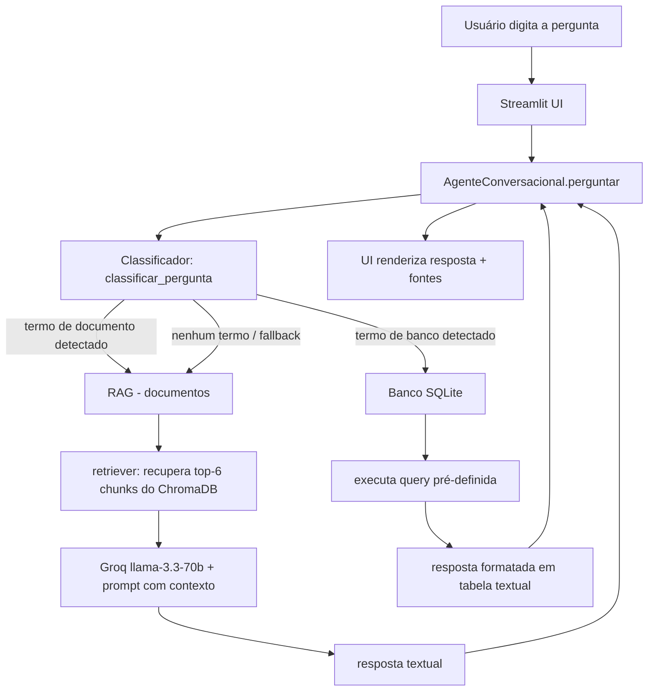
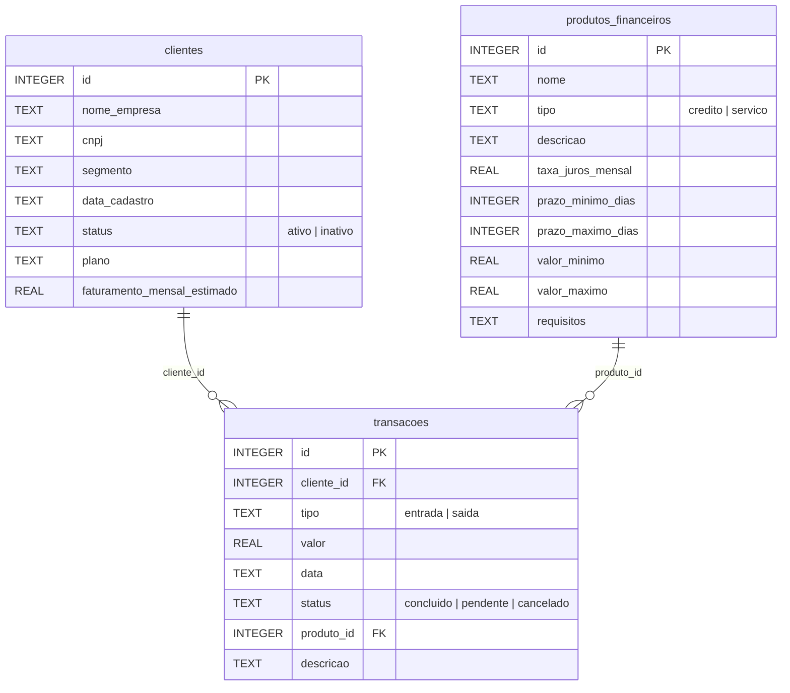
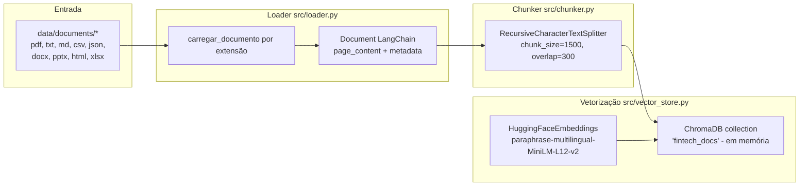
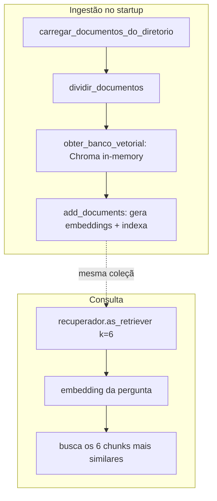
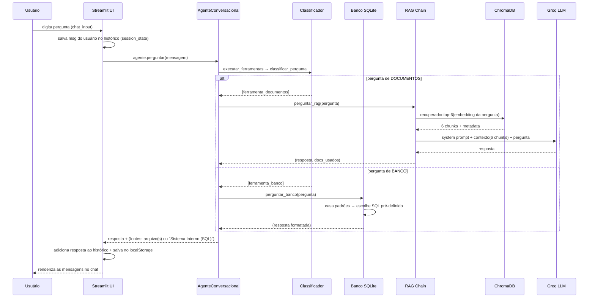
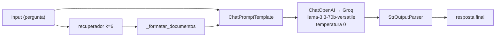
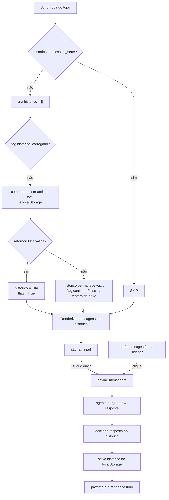

# Guia Técnico Completo — Agente Fintech

**Objetivo deste documento:** explicar, passo a passo e em detalhes, todo o fluxo da aplicação — desde o usuário digitando uma pergunta até a resposta renderizada na tela — incluindo a lógica de **RAG (Retrieval-Augmented Generation)**, o **banco de dados com queries pré-definidas**, o **classificador de intenção** e a **UI em Streamlit** com persistência de histórico.

Este guia foi escrito para servir de material de estudo e base para uma reimplementação futura.

---

## Sumário

1. [Visão Geral](#1-visão-geral)
2. [Arquitetura da Aplicação](#2-arquitetura-da-aplicação)
3. [Os Dados](#3-os-dados)
4. [Pipeline de Ingestão (como os documentos entram no RAG)](#4-pipeline-de-ingestão)
5. [Pipeline de Consulta (o caminho de uma pergunta)](#5-pipeline-de-consulta)
6. [Componente por Componente](#6-componente-por-componente)
   - 6.1 [Classificador de Perguntas](#61-classificador-de-perguntas)
   - 6.2 [Banco de Dados (SQLite + regras)](#62-banco-de-dados)
   - 6.3 [RAG (ChromaDB + Embeddings + LLM)](#63-rag)
   - 6.4 [Agente Conversacional (orquestrador)](#64-agente-conversacional)
   - 6.5 [UI Streamlit](#65-ui-streamlit)
7. [Exemplos Reais Passo a Passo](#7-exemplos-reais-passo-a-passo)
8. [Decisões de Design e Armadilhas Encontradas](#8-decisões-de-design-e-armadilhas)
9. [Como Reimplementar do Zero (checklist)](#9-como-reimplementar-do-zero)
10. [Referência Rápida de Código](#10-referência-rápida-de-código)

---

## 1. Visão Geral

A aplicação é um **assistente virtual** (chatbot) que responde perguntas de colaboradores de uma fintech usando **duas fontes de conhecimento diferentes**:

| Fonte | Tipo de dado | Tecnologia | Perguntas típicas |
|---|---|---|---|
| **Documentos** | Não estruturado (PDF, TXT, MD) | **RAG**: ChromaDB + embeddings + LLM | "Como o Nubank trata meus dados?" |
| **Banco de dados** | Estruturado (tabelas SQL) | **SQLite** + motor de regras | "Qual a taxa de juros do crédito?" |

A inteligência central está em **decidir qual fonte consultar** (o *classificador*) e, depois, **formatar a resposta** de acordo com a fonte escolhida.

### Os 3 pilares

1. **RAG** — para perguntas sobre documentos. O LLM responde com base em trechos recuperados dos documentos (não "de cabeça"), reduzindo alucinações.
2. **SQL com queries pré-definidas** — para perguntas sobre dados estruturados. Não há LLM gerando SQL livre (mais seguro, determinístico); em vez disso, um motor de **regras de padrão** escolhe a consulta certa.
3. **Classificador heurístico** — um *roteador* baseado em palavras-chave que envia cada pergunta para o pipeline correto.

---

## 2. Arquitetura da Aplicação

```
┌─────────────────────────────────────────────────────────────────┐
│                     FRONTEND (Streamlit)                        │
│  app/streamlit_app.py                                           │
│  • Renderiza o chat (st.chat_message)                           │
│  • Gerencia histórico (session_state + localStorage)            │
│  • Sidebar com perguntas sugeridas                              │
└───────────────────────────────┬─────────────────────────────────┘
                                │  agente.perguntar(mensagem)
                                ▼
┌─────────────────────────────────────────────────────────────────┐
│                AGENTE (src/agent.py)                            │
│  AgenteConversacional: orquestra ferramentas e junta respostas  │
└───────────────────────────────┬─────────────────────────────────┘
                                │  executar_ferramentas(pergunta)
                                ▼
┌─────────────────────────────────────────────────────────────────┐
│           CLASSIFICADOR (src/ferramentas.py)                    │
│  classificar_pergunta() → escolhe UMA ferramenta                │
│  por palavras-chave (palavra inteira + plural opcional)         │
└───────────────┬─────────────────────────────────┬───────────────┘
                │  documentos                      │  banco de dados
                ▼                                 ▼
┌───────────────────────────┐       ┌─────────────────────────────┐
│   RAG (src/retriever.py)  │       │  BANCO (src/banco.py)       │
│  retriever.py + vector    │       │  SQLite em memória          │
│  ChromaDB (in-memory)     │       │  Motor de regras NL→SQL     │
│  Embeddings HF multiling  │       │  Queries pré-definidas      │
│  Chain LCEL → Groq LLM    │       │                             │
└───────────┬───────────────┘       └─────────────┬───────────────┘
            │                                     │
            ▼                                     ▼
┌───────────────────────────┐       ┌─────────────────────────────┐
│      CHROMADB             │       │   SQLite (:memory:)         │
│  coleção "fintech_docs"   │       │   clientes / produtos /     │
│  chunks vetorizados       │       │   transacoes                │
└───────────────────────────┘       └─────────────────────────────┘
            │
            ▼
┌───────────────────────────┐
│  HuggingFace Embeddings   │
│  paraphrase-multilingual- │
│  MiniLM-L12-v2            │
└───────────────────────────┘

   Dependência externa: Groq API (llama-3.3-70b-versatile)
   usada APENAS no caminho de documentos (RAG).
```

### Fluxograma geral da aplicação (Mermaid)



> **Importante:** o caminho de banco de dados **não** chama o LLM. O caminho de documentos sim. Isso é uma escolha deliberada (ver [Seção 8](#8-decisões-de-design-e-armadilhas)).

---

## 3. Os Dados

### 3.1 Documentos (fonte do RAG)

Localizados em `data/documents/`:

| Arquivo | Tipo |
|---|---|
| `nubank_aviso_privacidade.txt` | aviso de privacidade |
| `stripe_privacy_policy.md` | política de privacidade |
| `mercadopago_contrato_cartao.md` | contrato de cartão |
| `picpay_politica_privacidade.pdf` | política de privacidade (PDF) |

### 3.2 Banco de dados (fonte SQL)

Localizados em `data/*.csv` e carregados em um **SQLite em memória** (`:memory:`). Três tabelas:



- **10 clientes**, **6 produtos financeiros**, **22 transações**.
- Exemplo de produto de crédito: `Antecipacao de Recebiveis` com `taxa_juros_mensal = 2.5`.
- As restrições `CHECK` (`status IN ('ativo','inativo')`, etc.) garantem integridade dos dados.

---

## 4. Pipeline de Ingestão

Este é o **fluxo offline**: transforma documentos crus em *chunks vetorizados* dentro do ChromaDB.



### 4.1 Loader — `src/loader.py`

Responsabilidade: **ler um arquivo físico e transformá-lo em objetos `Document` do LangChain**.

Um `Document` do LangChain tem:
- `page_content` → o texto extraído.
- `metadata` → dicionário com contexto (ex.: `{"source": "...", "pagina": 1}`).

O loader é **orientado por extensão** (`mapa_ext`). Para cada extensão há uma função:

| Extensão | Função | Comportamento |
|---|---|---|
| `.pdf` | `_carregar_pdf` | extrai texto **página a página** com `pypdf`; 1 `Document` por página |
| `.txt`, `.md` | `_carregar_texto` | lê todo o arquivo como 1 `Document` |
| `.csv` | `_carregar_csv` | 1 `Document` por linha, no formato `chave: valor` |
| `.json` | `_carregar_json` | serializa o JSON inteiro como 1 `Document` |
| `.docx` | `_carregar_docx` | junta parágrafos não vazios |
| `.pptx` | `_carregar_pptx` | 1 `Document` por slide |
| `.html/.htm` | `_carregar_html` | limpa tags com `BeautifulSoup` |
| `.xlsx/.xls` | `_carregar_xlsx` | 1 `Document` por aba (via pandas) |

**Detalhes importantes do loader:**

1. **Imports tardios (lazy):** cada função importa a biblioteca pesada (pypdf, docx, pptx, bs4, pandas) **dentro da própria função**, nunca no topo do módulo. Isso evita custo de importação se a extensão não for usada e evita *side effects* ao importar o módulo.
2. **Tratamento de erro por arquivo:** `carregar_documentos_do_diretorio` percorre o diretório e usa `try/except` por arquivo — um arquivo corrompido **não derruba** a ingestão dos demais; apenas loga um `warning`.
3. **Metadata enriquecida:** cada tipo de documento adiciona informações úteis para a etapa de citação (ex.: `pagina`, `aba`, `linha`).

```python
# Exemplo simplificado: extração de PDF
def _carregar_pdf(caminho):
    from pypdf import PdfReader          # import tardio
    leitor = PdfReader(caminho)
    docs = []
    for i, pagina in enumerate(leitor.pages):
        texto = pagina.extract_text()
        if texto.strip():
            docs.append(Document(
                page_content=texto,
                metadata={"source": caminho, "pagina": i + 1,
                          "total_paginas": len(leitor.pages)},
            ))
    return docs
```

### 4.2 Chunker — `src/chunker.py`

Responsabilidade: **quebrar documentos grandes em pedaços (chunks) menores**, porque:

- O modelo de embeddings tem um **tamanho máximo de entrada** (geralmente 512 tokens).
- O ChromaDB recupera por similaridade de vetores — pedaços pequenos = busca mais precisa.
- O contexto enviado ao LLM tem um limite; enviar só o trecho relevante economiza tokens e melhora a resposta.

Uso do `RecursiveCharacterTextSplitter`:

```python
divisor = RecursiveCharacterTextSplitter(
    chunk_size=1500,          # tamanho alvo do chunk (caracteres)
    chunk_overlap=300,        # sobreposição entre chunks vizinhos
    separators=["\n\n", "\n", ". ", " ", ""],  # ordem de quebra
    length_function=len,      # mede por quantidade de caracteres
)
```

**Por que a sobreposição (overlap) existe?** Se um parágrafo for cortado ao meio, a parte final do chunk N e o início do chunk N+1 se repetem, garantindo que **nenhuma informação fique perdida na fronteira** e que o contexto seja preservado.

**Por que esses separators?** O splitter tenta quebrar primeiro por parágrafo (`\n\n`), depois por linha (`\n`), depois por fim de frase (`. `), depois por espaço, e só em último caso corta no meio de uma palavra. Isso preserva a **coerência semântica** dos pedaços.

### 4.3 Vetorização e Indexação — `src/vector_store.py`

Responsabilidade: **transformar texto em vetores numéricos e armazená-los** para busca por similaridade.

1. **Embeddings:** usa `HuggingFaceEmbeddings` com o modelo
   `sentence-transformers/paraphrase-multilingual-MiniLM-L12-v2`.
   - É um modelo **multilíngue** — crucial porque os documentos e as perguntas estão em português.
   - Um embedding é um vetor de números que representa o **sentido** do texto, não as palavras exatas. Textos com sentido parecido ficam próximos no espaço vetorial.

2. **ChromaDB:** o banco vetorial é criado com `Chroma(collection_name="fintech_docs", embedding_function=embeddings)`.
   - **Sem `persist_directory`** → banco **100% em memória**. Toda vez que o processo reinicia, a indexação é refeita.
   - Isso é intencional para compatibilidade com o **sistema de arquivos efêmero** do Streamlit Sharing (que apaga arquivos locais entre deploys).

3. **Ingestão no startup** (`ingerir_documentos_no_startup`):
   ```python
   docs = carregar_documentos_do_diretorio(DIR_DOCS)   # 1. carrega
   pedacos = dividir_documentos(docs)                   # 2. chunk
   banco_vetorial.add_documents(pedacos)                # 3. vetoriza + indexa
   ```



---

## 5. Pipeline de Consulta

O caminho completo de uma pergunta, do clique do usuário até a resposta:



### Resumo em 8 passos

1. **UI captura a pergunta** (`st.chat_input` ou botão de sugestão na sidebar).
2. **Histórico da UI** ganha a mensagem do usuário.
3. **Agente orquestra**: `AgenteConversacional.perguntar()` chama `executar_ferramentas()`.
4. **Classificador decide o caminho** (documentos vs banco).
5. **O caminho escolhido executa** e produz uma resposta em texto.
6. **Agente agrega** respostas e concatena as **fontes**.
7. **UI exibe** a resposta como mensagem do agente e **persiste no localStorage**.
8. (Fim do *run* do Streamlit — o script re-executa do topo na próxima interação.)

---

## 6. Componente por Componente

### 6.1 Classificador de Perguntas

Arquivo: `src/ferramentas.py`

#### Objetivo

Decidir, de forma **rápida e determinística**, se a pergunta deve ir para o RAG (documentos) ou para o banco de dados.

#### Algoritmo

```mermaid
flowchart TD
    P[Pergunta do usuário] --> N[_normalizar: minúsculas + remover acentos]
    N --> M[match de palavras-chave por palavra inteira]
    M --> D{Existe termo de<br/>DOCUMENTO?}
    D -->|sim| DOCS[→ ferramenta_documentos (RAG)]
    D -->|não| B{Existe termo de<br/>BANCO?}
    B -->|sim| BANCO[→ ferramenta_banco (SQL)]
    B -->|não| DOCS2[→ ferramenta_documentos - FALLBACK]
```

#### As duas funções-chave

```python
def _normalizar(texto: str) -> str:
    """Remove acentos e converte para minúsculas."""
    texto = texto.lower()
    return "".join(c for c in unicodedata.normalize("NFD", texto)
                   if unicodedata.category(c) != "Mn")

def _termo_na_pergunta(termo: str, p: str) -> bool:
    """Casa termos como palavra inteira (plural opcional); frases via substring."""
    if " " in termo:                    # frase (ex.: "conta digital")
        return termo in p
    return bool(re.search(rf"\b{re.escape(termo)}s?\b", p))  # palavra + plural opcional
```

**O que essas funções resolvem (lições importantes):**

1. **Acentuação:** a pergunta "Qual a taxa de **juros** do **crédito**?" precisa bater com a palavra-chave `credito`. `_normalizar` remove o acento de "crédito" → `credito`. Sem isso, o matching falharia.
2. **Maiúsculas/minúsculas:** tudo vira minúsculo.
3. **Palavra inteira (`\b`):** evita falsos positivos. Com substring simples, a palavra "taxa" dentro de "atacado" ou "contato" causaria matches errados.
4. **Plural opcional (`s?`):** a mesma regra casa `produto` e `produtos`, `transacao` e `transacoes`, sem listar os dois.

#### Listas de palavras-chave

| Documentos (→ RAG) | Banco (→ SQL) |
|---|---|
| `politica`, `privacidade`, `contrato`, `termo`, `biometrico` | `cliente`, `empresa`, `cnpj`, `faturamento`, `segmento` |
| `nubank`, `stripe`, `picpay`, `mercadopago`, `documento` | `transacao`, `movimentacao`, `entrada`, `saida`, `receita`, `despesa` |
| `lgpd`, `dado pessoal`, `clausula`, `procedimento` | `total`, `maior`, `menor`, `media`, `top`, `ranking`, `giro` |
| `limite`, `reserva`, `parcelamento`, `fatura` | `conta digital`, `maquininha`, `cambio`, `antecipacao` |
| `cancelar`, `contratar`, `adesao`, `juros do rotativo` | `cadastrados`, `listar`, `quantos`, `produto`, `credito` |
| | `taxa`, `juros`, `servico`, `valor`, `cartao`, `plano`, `emprestimo` |

#### Regras de prioridade

1. **Documentos têm prioridade** sobre banco em caso de ambiguidade (ex.: "limite" existe nas duas listas, mas a pergunta "Como funciona o limite de crédito com reserva?" vai para documentos porque `limite` está na lista de documentos).
2. **Fallback padrão → documentos.** Se nenhuma palavra-chave bater, a pergunta vai para o RAG (mais flexível que o motor de regras do banco).

> **Por que não usar um LLM para classificar?** Custo zero, determinístico (mesma pergunta → mesma rota), rápido e fácil de testar com 14 testes de regressão. O preço é a manutenção das listas de palavras.

---

### 6.2 Banco de Dados

Arquivo: `src/banco.py`

#### 6.2.1 Conexão em memória

```python
_conn: Optional[sqlite3.Connection] = None

def _get_conn() -> sqlite3.Connection:
    global _conn
    if _conn is None:
        _conn = sqlite3.connect(":memory:", check_same_thread=False)
        _conn.row_factory = sqlite3.Row
        _conn.execute("PRAGMA foreign_keys = ON")
    return _conn
```

- `:memory:` → banco inteiro na RAM. **Some quando o processo morre.**
- `check_same_thread=False` → permite uso da mesma conexão em múltiplas threads (Streamlit roda o script em threads).
- `row_factory = sqlite3.Row` → permite acessar colunas por nome.
- Variável global `_conn` com *lazy init* (criada só no primeiro uso) → **sem side effects no import**.

#### 6.2.2 Inicialização e carga de dados

`inicializar_banco()`:
1. Cria as 3 tabelas com `CREATE TABLE IF NOT EXISTS` (inclui `CHECK` e `FOREIGN KEY`).
2. Importa os CSVs com `_importar_csv`:
   - Lê o CSV com `csv.DictReader` (cabeçalho → nomes de colunas).
   - Monta um `INSERT OR IGNORE` genérico (adaptado às colunas do arquivo).
   - `OR IGNORE` evita duplicar dados se a carga rodar duas vezes.

#### 6.2.3 O "tradutor" de linguagem natural → SQL

`perguntar_banco(pergunta)` é um **motor de regras**:

```mermaid
flowchart TD
    Q[pergunta.lower()] --> A{palavras de<br/>cliente/empresa/cnpj/cadastro?}
    A -->|sim| B{listar/quantos/quais?}
    B -->|sim| C{ativo ou inativo?}
    C -->|ativo| C1[SELECT clientes WHERE status='ativo' ORDER BY faturamento DESC]
    C -->|inativo| C2[SELECT clientes WHERE status='inativo']
    C -->|nenhum| C3[SELECT todos os clientes ORDER BY id]
    B -->|maior/top/mais| C4[Top 5 por faturamento]
    B -->|media/medio| C5[COUNT + AVG de faturamento]
    B -->|segment| C6[GROUP BY segmento]
    B -->|plano| C7[GROUP BY plano]
    B -->|nenhum dos acima| C8[SELECT clientes LIMIT 15]

    A -->|não| D{palavras de<br/>produto/servico/credito/cartao/linha?}
    D -->|sim| E{listar/quais/dispon?}
    E -->|sim| E1[SELECT todos os produtos ORDER BY id]
    E -->|credito/emprestimo/giro| E2[SELECT produtos WHERE tipo='credito' ORDER BY taxa]
    E -->|servico| E3[SELECT produtos WHERE tipo='servico']
    E -->|menor/barato/baixo| E4[Top 3 menores taxas]
    E -->|nenhum| E5[SELECT produtos LIMIT 15]

    D -->|não| F{palavras de<br/>transacao/movimentacao/entrada/saida?}
    F -->|sim| G{listar?}
    G -->|sim| G1[Transações recentes LIMIT 15]
    G -->|pendente| G2[WHERE status='pendente']
    G -->|total| G3{entrada?} 
    G3 -->|sim| G4[SUM entradas concluídas]
    G3 -->|não| G5{saida?}
    G5 -->|sim| G6[SUM saídas concluídas]
    G5 -->|não| G7[Resumo financeiro: entradas e saídas]
    G -->|conclu/realizada| G8[WHERE status='concluido']
    G -->|cancel| G9[WHERE status='cancelado']
    G -->|maior| G10[Top 5 transações por valor]
    G -->|nenhum| G11[Transações LIMIT 15]

    F -->|não| H[SQL genérico: detecta número no texto<br/>→ SELECT cliente por id]
    H --> I[Se nada casar: mensagem informativa]
```

**Características fundamentais deste motor:**

1. **Nunca gera SQL livre** → sem risco de injeção e sem depender do LLM.
2. **Determinístico** → a mesma pergunta sempre produz a mesma resposta.
3. **Pré-definido e testável** → cada ramo é um `SELECT` fixo, com `JOIN` explícito (ex.: `transacoes t JOIN clientes c ON t.cliente_id = c.id`).
4. **Ordem das verificações importa:** primeiro *clientes*, depois *produtos*, depois *transações*, depois *genérico*. Palavras como "cliente" e "transação" nunca colidem porque cada bloco é independente.
5. **Fallback amigável:** se nenhum padrão casar, retorna uma mensagem orientando o usuário sobre o que perguntar.

#### 6.2.4 Formatação da resposta

```python
def _formatar_resultado(titulo, resultados):
    if not resultados:
        return f"{titulo}: (nenhum resultado encontrado)"
    cabecalho = f"📊 {titulo}\n" + "-" * 40
    linhas = []
    for r in resultados:
        partes = [f"{k}: {v}" for k, v in r.items() if v is not None]
        linhas.append(" | ".join(partes))
    return cabecalho + "\n" + "\n".join(linhas)
```

Converte a lista de dicionários (resultado do SQL) em **tabela textual** legível. Nota: campos `NULL` são omitidos (`if v is not None`) — assim produtos de serviço sem taxa não exibem "None".

#### 6.2.5 Auxiliares de schema (usados para auto-documentar as ferramentas)

- `listar_tabelas()` → nomes das tabelas.
- `descrever_tabela()` → colunas e tipos via `PRAGMA table_info`.
- `resumo_banco()` → texto legível do schema (tabela + nº de registros + colunas).

> **Curiosidade:** o `resumo_banco()` é injetado na `description` da ferramenta de banco (`ferramenta_banco.description`) durante `inicializar_ferramentas()`. Isso é uma forma de "auto-documentação" — o schema vai parar na descrição da ferramenta, útil se um dia o agente usar agentes com LLM.

---

### 6.3 RAG

Arquivos: `src/retriever.py` + `src/vector_store.py`

#### O que é RAG?

**RAG = Retrieval-Augmented Generation** (Geração Aumentada por Recuperação). Em vez de o LLM responder "de cabeça" (memória do treino), a aplicação:

1. **Recupera** trechos relevantes dos documentos (via similaridade vetorial).
2. **Injeta** esses trechos no prompt como *contexto*.
3. **Gera** a resposta com base *apenas* no contexto fornecido.

Isso reduz alucinações, permite citar fontes e mantém a base de conhecimento atualizável **sem retreinar o modelo**.

#### 6.3.1 A cadeia LCEL (LangChain Expression Language)

`criar_cadeia_qa()` monta um pipeline declarativo:



```python
cadeia = (
    {
        "context": itemgetter("input") | recuperador | _formatar_documentos,
        "input": itemgetter("input"),
    }
    | PROMPT
    | llm
    | StrOutputParser()
)
```

**Leitura do pipeline:**
- Entrada: dicionário com `input` (a pergunta).
- O campo `context` é produzido por um *sub-pipeline*: pega o `input`, passa pelo **retriever** (que retorna 6 `Document`s) e depois pelo **formatador** (que junta os textos com `\n\n---\n\n`).
- O campo `input` é repassado direto.
- O `ChatPromptTemplate` monta o prompt final (system + contexto + pergunta).
- O LLM gera o texto; o `StrOutputParser` extrai só a string.

#### 6.3.2 O recuperador (retriever)

```python
banco_vetorial = obter_banco_vetorial()
recuperador = banco_vetorial.as_retriever(search_kwargs={"k": 6})
```

- `k=6` → recupera os **6 chunks mais similares** à pergunta.
- A similaridade é calculada entre o **embedding da pergunta** e os **embeddings dos chunks** (distância de cosseno).

#### 6.3.3 O prompt de sistema (a "cola" do RAG)

```python
PROMPT_SISTEMA = """
Voce e um assistente virtual especializado em documentos internos de uma fintech.
Use APENAS o contexto fornecido abaixo para responder a pergunta do colaborador.

REGRAS:
1. Se a resposta estiver no contexto, responda com precisao...
2. Se a resposta NAO estiver claramente no contexto, diga exatamente:
   "Nao encontrei essa informacao nos documentos disponiveis."
   Nao invente nem complete informacoes que nao estao no contexto.
3. Sempre mencione ao final o nome do documento de onde a informacao foi extraida.
4. Se o contexto mencionar multiplos documentos, indique qual deles contem a resposta.
5. Responda em portugues claro e objetivo.

Contexto:
{context}

Pergunta: {input}

Resposta:
"""
```

**Anatomia do prompt:**
- **Role system:** define a personalidade e as regras (especialista, usar só o contexto, não inventar, citar documento, português).
- **Placeholder `{context}`:** recebe os chunks formatados.
- **Placeholder `{input}`:** recebe a pergunta.
- A regra nº 2 é o **mecanismo anti-alucinação** mais importante: quando não há resposta no contexto, o modelo é instruído a dizer exatamente a frase de fallback.

#### 6.3.4 A configuração do LLM (Groq)

```python
URL_GROQ = "https://api.groq.com/openai/v1"
MODELO_PADRAO = "llama-3.3-70b-versatile"

chave_api = os.getenv("OPENAI_API_KEY", "") or os.getenv("GROQ_API_KEY", "")
if chave_api.startswith("gsk_"):
    modelo = MODELO_PADRAO
    llm = ChatOpenAI(
        model=modelo,
        temperature=temperatura,      # 0.0 → determinístico
        openai_api_key=chave_api,
        openai_api_base=URL_GROQ,     # endpoint compatível com OpenAI
        timeout=30,                   # evita travar para sempre
        max_retries=2,                # tenta até 2 vezes em falha de rede
    )
```

**Decisões importantes:**
- **Groq é compatível com a API OpenAI** → basta trocar `openai_api_base` para `https://api.groq.com/openai/v1` e usar a chave `gsk_`. Sem SDK específico.
- **`temperature=0.0`** → respostas mais reprodutíveis e factuais (importante para o caso de uso).
- **`timeout=30` + `max_retries=2`** → resiliência: a chamada não trava o app indefinidamente.
- **Fallback para `gpt-4o-mini`** → se a chave não for do Groq (`gsk_`), usa OpenAI padrão (flexibilidade de provedores).

#### 6.3.5 Citações de fontes

```python
def consultar_documentos(pergunta):
    resultado, docs = perguntar_rag(pergunta, cadeia=_cadeia, recuperador=_recuperador)
    fontes = set()
    for doc in docs if docs else []:
        nome = doc.metadata.get("source", "").split("/")[-1]  # só o nome do arquivo
        if nome:
            fontes.add(nome)
    return resultado, "Documentos", sorted(fontes)
```

- O retriever devolve os `Document`s usados (não só o texto da resposta).
- As fontes vêm do `metadata["source"]` (caminho do arquivo); `split("/")[-1]` extrai **só o nome do arquivo**.
- `set()` + `sorted()` → elimina duplicatas e ordena.

---

### 6.4 Agente Conversacional

Arquivo: `src/agent.py`

É o **orquestrador**. Define o contrato da "ferramenta" como tupla `(resposta, nome_ferramenta, fontes)`.

```python
class AgenteConversacional:
    def __init__(self):
        self.historico = []
        inicializar_ferramentas()      # lazy: carrega banco + RAG + chroma no 1º uso

    def perguntar(self, mensagem: str) -> str:
        resultados = executar_ferramentas(mensagem)   # lista de tuplas

        textos, todas_fontes = [], set()
        for resposta, _, fontes in resultados:
            textos.append(resposta)
            todas_fontes.update(fontes)

        resposta = "\n\n".join(textos)
        if todas_fontes:
            resposta += f"\n\n(Fontes: {', '.join(sorted(todas_fontes))})"

        self.historico.append({"pergunta": mensagem, "resposta": resposta})
        return resposta
```

**Pontos-chave:**
- `inicializar_ferramentas()` é chamado no construtor (lazy, protegido por flag `_inicializado` — ver abaixo).
- Junta múltiplas respostas com `\n\n` e anexa um bloco `(Fontes: ...)`.
- Mantém um histórico próprio (do agente) além do histórico da UI.

#### O padrão de inicialização lazy (`ferramentas.py`)

```python
_inicializado = False
_cadeia = None
_recuperador = None

def inicializar_ferramentas():
    global _inicializado, _cadeia, _recuperador
    if _inicializado:
        return
    inicializar_banco()                # cria SQLite in-memory + CSVs
    _cadeia, _recuperador = criar_cadeia_qa()   # carrega embeddings + retriever
    ingerir_documentos_no_startup()    # indexa documentos no Chroma
    ferramenta_banco.description = ... # injeta schema na descrição
    _inicializado = True
```

**Por que lazy?** No import do módulo não acontece *nada* pesado (sem conexão, sem Chroma, sem download de modelo). Tudo é carregado no **primeiro uso real**. Isso evita:
- Timeout/erro ao importar módulos em testes ou ferramentas que só querem o classificador.
- Consumo de memória/processamento desnecessário.

---

### 6.5 UI Streamlit

Arquivo: `app/streamlit_app.py`

#### 6.5.1 Estrutura básica de um *run* do Streamlit

O Streamlit re-executa **o script inteiro de cima a baixo** a cada interação (clique, envio de chat, etc.). O estado entre runs vive em **`st.session_state`**. É por isso que:

- Widgets devem ter `key` estável (o valor é mantido no session_state).
- Dados caros devem ser cacheados (`@st.cache_resource` / `@st.cache_data`).
- A **ordem do código importa** (por isso a sidebar fica antes do loop de mensagens — ver [Seção 8](#8-decisões-de-design-e-armadilhas)).

```python
@st.cache_resource
def carregar_agente():
    return AgenteConversacional()   # cache por processo

@st.cache_data
def _documentos_disponiveis():
    return listar_documentos_disponiveis()   # cache por args
```

- `@st.cache_resource` → o agente (e toda a carga pesada do RAG/SQLite) é criado **uma única vez** por sessão do servidor.
- `@st.cache_data` → listagem de documentos, sem I/O repetido.

#### 6.5.2 Fluxo da UI



#### 6.5.3 Persistência do histórico com localStorage

O `st.session_state` **zera a cada recarga (F5)**. Para o histórico sobreviver, usamos o **localStorage do navegador**, acessado via um componente custom (`streamlit-js-eval`).

```python
CHAVE_HISTORICO = "historico_chat_fintech"

def _historico_do_local_storage():
    """Lê o histórico persistido no localStorage."""
    valor = streamlit_js_eval(
        js_expressions=f"localStorage.getItem('{CHAVE_HISTORICO}')",
        key="ler_historico",
        want_output=True,       # pede o valor de volta ao Python
    )
    if valor:
        dados = json.loads(valor)
        if isinstance(dados, list):
            return dados
    return None

def _salvar_historico(historico):
    conteudo = json.dumps(historico, ensure_ascii=False)
    chave_hash = hashlib.md5(conteudo.encode()).hexdigest()[:16]
    streamlit_js_eval(
        js_expressions=(
            f"localStorage.setItem('{CHAVE_HISTORICO}', "
            f"{json.dumps(conteudo)})"
        ),
        key=f"salvar_{chave_hash}",
        want_output=False,      # fogo-e-esqueça: não precisa de retorno
    )
```

**Como o componente funciona:**
- `streamlit-js-eval` cria um `<iframe>` que executa a expressão JS no navegador.
- `want_output=True` → o iframe devolve o resultado ao Python (para ler).
- `want_output=False` → executa e ignora o retorno (para gravar/limpar).

**A armadilha do `None` no primeiro render (lição importante):**
Na primeira renderização de um componente custom, o iframe **ainda não montou** — o Python recebe `None` em vez do valor real. Se você marcar "já carreguei" logo na primeira vez, o valor verdadeiro que chega depois é ignorado e o histórico nunca é restaurado.

**A solução:** só marcar `historico_carregado = True` quando um valor **real** (lista) for lido:

```python
if not st.session_state.get("historico_carregado"):
    historico = _historico_do_local_storage()
    if isinstance(historico, list):
        st.session_state.historico = historico
        st.session_state.historico_carregado = True
```

Quando o iframe envia o valor, o Streamlit **dispara outro run**; nesse run o componente devolve o valor armazenado e o histórico é restaurado.

**A chave única por conteúdo:** `key=f"salvar_{hash}"` faz com que o Streamlit **re-aproveite** o componente quando o conteúdo não mudou (sem re-executar o JS) e crie um **novo** quando mudou. Evita reescritas desnecessárias.

#### 6.5.4 Envio de mensagens

```python
def enviar_mensagem(pergunta=None):
    if pergunta is None:                      # veio do chat_input
        pergunta = st.session_state.input_usuario.strip()
        st.session_state.input_usuario = ""
    pergunta = pergunta.strip()
    if not pergunta:
        return

    st.session_state.historico.append({"papel": "usuario", "texto": pergunta})

    with st.spinner("Consultando documentos e banco de dados..."):
        try:
            agente = carregar_agente()
            resposta = agente.perguntar(pergunta)
            st.session_state.historico.append({"papel": "agente", "texto": resposta})
        except TimeoutError:
            st.session_state.historico.append(
                {"papel": "agente",
                 "texto": "**Servico temporariamente indisponivel.** ..."})
        except Exception as e:
            st.session_state.historico.append(
                {"papel": "agente", "texto": f"**Erro inesperado:** {e}"})

    st.session_state.historico = st.session_state.historico[-50:]  # limite
    _salvar_historico(st.session_state.historico)
```

**Detalhes:**
- Mesma função atende **chat_input** (pergunta vem do widget) e **botões de sugestão** (pergunta vem como argumento).
- `st.chat_input(..., key="input_usuario", on_submit=enviar_mensagem)` chama a função no envio.
- Tratamento de erro robusto: `TimeoutError` (da API) tem mensagem amigável; qualquer outra exceção também é capturada — **o app nunca quebra por causa do backend**.
- Limite de 50 mensagens e **salvamento automático** após cada interação.

#### 6.5.5 Perguntas sugeridas (sidebar)

```python
SUGESTOES = {
    "📊 Banco de dados": [
        "Qual a taxa de juros do credito?",
        "Quais produtos financeiros existem?",
        ...
    ],
    "📄 Documentos": [
        "Como o Nubank trata meus dados pessoais?",
        "O que a politica de privacidade da Stripe diz sobre cookies?",
    ],
}

for titulo, perguntas in SUGESTOES.items():
    for pergunta in perguntas:
        if st.button(pergunta, key=f"sugestao_{i}", use_container_width=True):
            enviar_mensagem(pergunta)   # envia direto, sem digitar
```

**Lição de UX (importante):** a sidebar deve ser processada **antes** do loop que renderiza as mensagens. Se for depois, o clique da sugestão atualiza o histórico **depois** da renderização — e a resposta só aparece num segundo clique/run. Com a sidebar antes, o histórico já está atualizado quando as mensagens são renderizadas no mesmo run.

---

## 7. Exemplos Reais Passo a Passo

### Exemplo A — Pergunta de banco de dados

> **Usuário:** "Qual a taxa de juros do credito?"

| Etapa | O que acontece | Onde |
|---|---|---|
| 1 | `st.chat_input` captura o texto | `app/streamlit_app.py` |
| 2 | `enviar_mensagem()` → adiciona msg do usuário ao histórico | `app/streamlit_app.py` |
| 3 | `agente.perguntar("Qual a taxa de juros do credito?")` | `src/agent.py` |
| 4 | `classificar_pergunta` normaliza: "qual a taxa de juros do credito?" | `src/ferramentas.py` |
| 5 | Match de **documentos**? Não. Match de **banco**? Sim → `credito`, `juros`, `taxa` | `src/ferramentas.py` |
| 6 | `consultar_banco("...")` → `perguntar_banco` | `src/banco.py` |
| 7 | Detecta `credito` no bloco de produtos → `SELECT ... WHERE tipo='credito' ORDER BY taxa_juros_mensal` | `src/banco.py` |
| 8 | SQLite retorna os produtos de crédito ordenados | `src/banco.py` |
| 9 | `_formatar_resultado` monta a tabela textual | `src/banco.py` |
| 10 | Agente anexa fonte `(Fontes: Sistema Interno (SQL))` | `src/agent.py` |
| 11 | UI adiciona resposta ao histórico e salva no localStorage | `app/streamlit_app.py` |
| 12 | Renderiza tudo no chat | `app/streamlit_app.py` |

**Resposta gerada (resumo):**
```
📊 Produtos de credito
----------------------------------------
id: 1 | nome: Antecipacao de Recebiveis | tipo: credito | taxa_juros_mensal: 2.5 | ...
id: 4 | nome: Linha de Credito GIRO | ... | taxa_juros_mensal: 3.2 | ...

(Fontes: Sistema Interno (SQL))
```

### Exemplo B — Pergunta de documentos (RAG)

> **Usuário:** "Como o Nubank trata meus dados pessoais?"

| Etapa | O que acontece | Onde |
|---|---|---|
| 1–3 | igual ao Exemplo A até o agente | — |
| 4 | Classificador: `nubank`, `dado pessoal` estão na lista de documentos → **prioridade documentos** | `src/ferramentas.py` |
| 5 | `consultar_documentos("...")` → `perguntar_rag` | `src/ferramentas.py` |
| 6 | Retriever gera embedding da pergunta e busca os 6 chunks mais similares no ChromaDB | `src/retriever.py` + `src/vector_store.py` |
| 7 | Os chunks são formatados (`\n\n---\n\n`) e injetados no `{context}` do prompt | `src/retriever.py` |
| 8 | Groq recebe system + contexto + pergunta e gera a resposta | Groq API |
| 9 | Agente coleta `metadata["source"]` → `nubank_aviso_privacidade.txt` | `src/ferramentas.py` |
| 10–12 | igual ao Exemplo A (exibe + persiste + renderiza) | `app/streamlit_app.py` |

**Resposta (resumo):** explica o tratamento de dados pessoais conforme o aviso e termina com o nome do documento.

---

## 8. Decisões de Design e Armadilhas

Estas são as decisões que mais impactaram o projeto — e as lições que valem para qualquer reimplementação.

### 8.1 Banco em memória (SQLite `:memory:` + Chroma sem persist)

**Problema resolvido:** o Streamlit Sharing usa **sistema de arquivos efêmero** — qualquer arquivo gravado localmente (SQLite em disco, persist do ChromaDB) é apagado a cada deploy/restart.

**Solução:** `sqlite3.connect(":memory:")` e `Chroma(collection_name=...)` **sem** `persist_directory`. O custo é reindexar no startup (alguns segundos), o que é aceitável.

**Lição:** conheça o ciclo de vida do ambiente de deploy antes de escolher onde persistir. Para dados que *precisam* sobreviver, use um serviço externo (PostgreSQL, S3, etc.), nunca o disco local de PaaS efêmero.

### 8.2 Classificador heurístico em vez de LLM

**Por quê:** custo zero, determinístico, rápido, fácil de testar (14 testes de regressão). **Limitação:** requer manutenção da lista de palavras.

**Lição:** nem sempre a solução "inteligente" (LLM) é a melhor. Se o domínio é pequeno e controlado, regras explícitas dão mais previsibilidade e testabilidade.

### 8.3 SQL pré-definido em vez de LLM gerando SQL

**Por quê:** zero risco de injeção, zero custo de tokens, respostas 100% determinísticas e testáveis. **Limitação:** só entende as perguntas previstas nos padrões.

**Lição:** para um domínio fechado (3 tabelas), regras vencem. Para um domínio aberto, aí sim use `text-to-SQL` com um LLM (e valide o SQL antes de executar).

### 8.4 Anti-alucinação no prompt

A regra "Se não estiver no contexto, diga `Nao encontrei essa informacao...`" é o **freio** mais importante do RAG. Sem ela, o modelo inventa respostas plausíveis.

**Lição:** sempre inclua um mecanismo explícito de "não sei" + instrução de citar a fonte. Combine isso com `temperature=0`.

### 8.5 Inicialização lazy (sem side effects no import)

Todos os módulos de `src/` são **seguros para importar**: nada pesado acontece no `import`. O estado (conexão, Chroma, cadeia) é criado sob demanda com flag `_inicializado`.

**Lição:** separar "definição" de "execução". Facilita testes unitários e evita efeitos colaterais surpresa (ex.: importar `ferramentas.py` baixando modelo de ML).

### 8.6 Armadilha: componentes retornam `None` no primeiro render

Se você chamar `streamlit_js_eval(..., want_output=True)` e tratar o `None` como "não tem valor", o histórico nunca restaura. A solução é o **loop com flag**: só considera carregado quando um valor real (lista) chega.

**Lição:** em Streamlit, componentes custom são **assíncronos** do ponto de vista do Python. Sempre modele o ciclo: primeiro render → None → iframe monta → envia valor → novo run → Python recebe.

### 8.7 Armadilha: ordem da sidebar vs. renderização das mensagens

O clique em `st.button` só "vale" naquele run, no ponto onde o botão aparece no script. Se o loop de mensagens estiver **antes** da sidebar, a mensagem nova não é renderizada no mesmo run → o usuário precisa clicar duas vezes.

**Solução:** processar a sidebar (que pode *escrever* no histórico) **antes** do loop de renderização.

**Lição:** em Streamlit, a **ordem do código é parte da lógica**. Side effects que alteram estado devem acontecer antes dos pontos de renderização desse estado.

### 8.8 `want_output=False` para gravações

Ao gravar/limpar o localStorage não há necessidade de retorno. Passar `want_output=False` evita que o componente faça o *round-trip* de valor para o Python (que, no default, envia o resultado de volta e dispara um rerun extra).

### 8.9 Resiliência de rede

`timeout=30` e `max_retries=2` no `ChatOpenAI` + `try/except` abrangente na UI garantem que falhas de API não derrubem o app.

### 8.10 Nota sobre a legenda da UI

A sidebar exibe "ChromaDB + all-MiniLM-L6-v2", mas o modelo real usado no código é o `paraphrase-multilingual-MiniLM-L12-v2`. Detalhe cosmético, mas ilustra: **documentação e UI podem ficar defasadas do código** — sempre confie no código.

---

## 9. Como Reimplementar do Zero

Checklist prático (ordem sugerida de construção):

### Fase 1 — Dados
- [ ] Definir as fontes de conhecimento (documentos + CSVs).
- [ ] Modelar as tabelas SQL e os arquivos de seed.
- [ ] Testar manualmente os SQLs antes de codificar o motor.

### Fase 2 — Núcleo RAG
- [ ] **Loader:** função por extensão → `Document` (page_content + metadata).
- [ ] **Chunker:** `RecursiveCharacterTextSplitter` (chunk 1500 / overlap 300).
- [ ] **Embeddings:** modelo multilíngue (para pt-BR).
- [ ] **Vector store:** ChromaDB (decida persistência conforme o deploy).
- [ ] **Retriever + chain LCEL:** `retriever | formatar | prompt | llm | parser`.
- [ ] **Prompt de sistema:** regras de não-inventar + citar fonte.

### Fase 3 — Camada de dados estruturados
- [ ] SQLite in-memory + carga de CSVs (`INSERT OR IGNORE`).
- [ ] Motor de regras: blocos de padrão por assunto (clientes → produtos → transações).
- [ ] Formatação de saída legível.

### Fase 4 — Orquestração
- [ ] Classificador (palavras-chave + normalização de acentos + palavra inteira + plural).
- [ ] `AgenteConversacional` que agrega respostas e fontes.
- [ ] Inicialização lazy para todos os recursos.

### Fase 5 — UI
- [ ] `st.chat_input` + `st.chat_message` + histórico em `session_state`.
- [ ] Cache (`@st.cache_resource` para o agente).
- [ ] Persistência no localStorage (componente JS) com o padrão flag/loop.
- [ ] Sidebar **antes** do loop de mensagens.
- [ ] Tratamento de erro amigável (timeout/API).

### Fase 6 — Qualidade
- [ ] Testes do classificador (regressão: acentos, plurais, ambiguidade).
- [ ] Testes do motor de banco (cada ramo de regra).
- [ ] Teste de ponta a ponta no navegador (de preferência com Playwright).
- [ ] Testar recarga da página (F5) e comportamento com falha de API.

---

## 10. Referência Rápida de Código

### Como rodar localmente

```bash
python3 -m venv .venv
source .venv/bin/activate
pip install -r requirements.txt
cp .env.example .env   # preencha GROQ_API_KEY="gsk_..."
streamlit run app/streamlit_app.py
```

### Testes

```bash
pytest tests/ -q          # suíte completa
pytest tests/test_classificador.py   # só o classificador
```

### Arquivos e responsabilidades

| Arquivo | Responsabilidade |
|---|---|
| `app/streamlit_app.py` | UI, histórico, localStorage, sugestões |
| `src/agent.py` | Orquestração (agente + ferramentas) |
| `src/ferramentas.py` | Classificador + execução de ferramentas |
| `src/retriever.py` | Cadeia RAG (LCEL) + LLM + prompt |
| `src/vector_store.py` | ChromaDB + embeddings + ingestão |
| `src/loader.py` | Leitura de arquivos por extensão |
| `src/chunker.py` | Quebra de documentos em chunks |
| `src/banco.py` | SQLite + motor de regras NL→SQL |
| `data/documents/` | Documentos-fonte do RAG |
| `data/*.csv` | Dados do SQLite |
| `tests/` | Testes de regressão |
